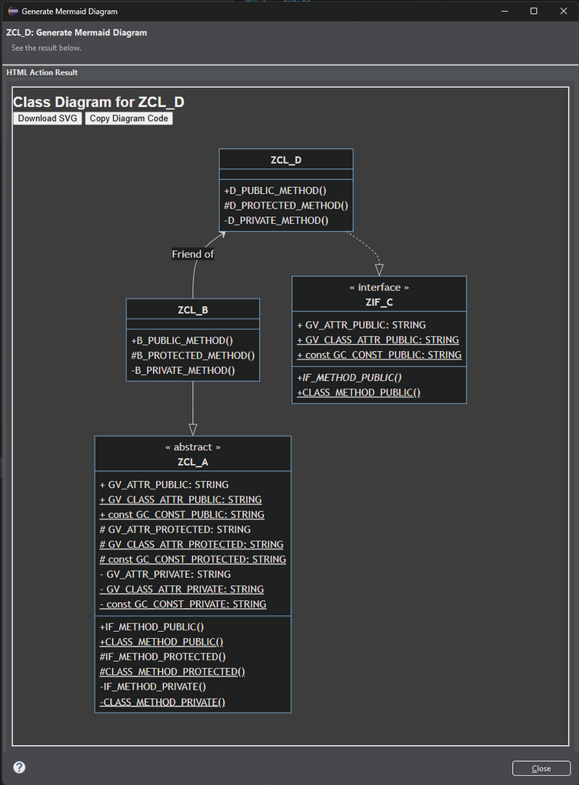
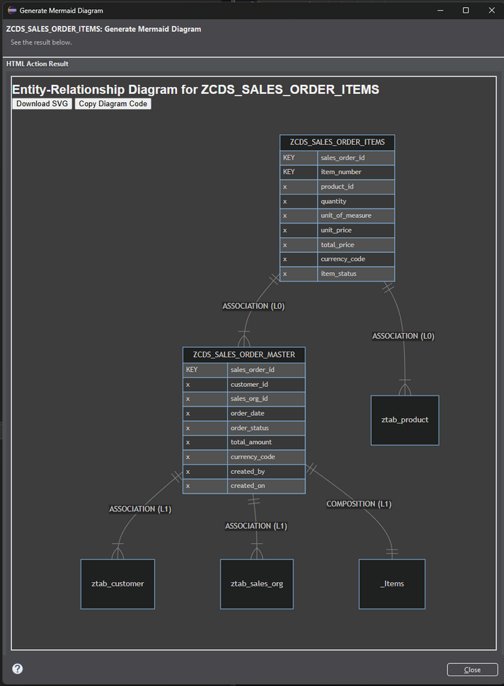

# Mermaid4ABAP

This project was developed as part of the practical course *Enterprise Software Engineering am Beispiel von SAP* at the Technical University of Munich (TUM) by Johannes Mesner and Alexander Schilling, in cooperation with SAP.

The provided code integrates with [ABAP Development Tools (ADT) IDE Actions](https://help.sap.com/docs/abap-cloud/abap-development-tools-user-guide/working-with-ide-actions) to generate and display [Mermaid diagrams](https://mermaid.js.org/intro/) for various ABAP development objects.

Currently, supported types for diagram generation include classes, interfaces, and CDS views.

### Examples
Class Diagram Example           |  CDS Diagram Example
:-------------------------:|:-------------------------:
  |  

## Setup

### Prerequisites

Before using this tool, ensure you have the following in place:

- Access to an ABAP system (e.g. a SAP BTP ABAP Environment or an on-premise system) that can be edited with ABAP Development Tools (ADT).
- The ADT Eclipse Plugin installed. [Installation Guide](https://developers.sap.com/tutorials/abap-install-adt..html)
- The abapGit Eclipse Plugin installed for managing ABAP repositories. [Installation Guide](https://eclipse.abapgit.org/updatesite/)

### Setup Process

Follow these steps to install and use the IDE Action:

1. **Create a package** to house your IDE Action code in your ABAP system.

2. Open the **abapGit Repositories** view in Eclipse:  
   *Window > Show View > Other > abapGit Repositories*

3. **Clone the repository** (refer to Step 8 in this [Tutorial](https://developers.sap.com/tutorials/abap-environment-abapgit.html) for screenshots):

    3.1. Click the **Clone** button (green “+” icon) in the abapGit Repositories view.
   
    3.2. Enter the following URL:  
    ```
    https://github.com/Mesnero/Mermaid4ABAP.git
    ```
    
    3.3. Select the appropriate branch (usually `main`) and choose the package you created. Check **Pull after link**.
    
    3.4. Select a transport request and click **Finish**.

5. **Add the IDE Action** manually in Eclipse, since the IDE Action type is not yet supported by abapGit:

    4.1. In your IDE Action package, create a new IDE Action via: **New > Other > IDE Action**.
   
    4.2. Provide a name and description, assign it to a transport request, and finish the creation wizard.
   
    4.3. Open the newly created IDE Action and enter a fitting **Title** and **Summary**. For example:  
    - **Title**: Generate Mermaid Diagram  
    - **Summary**: This IDE Action generates and displays Mermaid diagrams for selected file types.
   
    4.4. Select `ZCL_MERMAID_IDE_ACTION` as the implementing class by searching for it with the **Browse** button.
   
    4.5. Set **Number of Focused Resources** to “One.”
   
    4.6. To filter the action so it only appears for supported object types, optionally add the following under **Object Types**:  
    - CLAS  
    - DDLS  
    - INTF  
    - VIED

6. Use the newly created **IDE Action** to generate Mermaid diagrams from your ABAP objects!  

   **How to run:**  
   Select an ABAP object (e.g. a class or CDS view) by left-clicking on it, then either:
   - Press **CTRL + SHIFT + R**, or  
   - Navigate to **Run > Run ABAP IDE Action**, and select the action matching the title you provided.


## Contributing

**Disclaimer**: This project was created as part of a university course, so we cannot guarantee active maintenance. We also cannot guarantee that pull requests will always be reviewed or merged.

That said, we’d love to see awesome forks and are happy to review contributions when possible - but please understand we can’t make any promises.

---

### How to Contribute

If you’d like to contribute, here’s how to get started:

1. **Fork this repository** to your own GitHub account.

2. **Clone your fork** into your ABAP environment:  
   (See the [Setup Process](#setup-process) section above for details.)

3. Make your changes.

4. **Stage and push your changes** to your repository. (Often you’ll need a [GitHub Personal Access Token](https://docs.github.com/en/authentication/keeping-your-account-and-data-secure/managing-your-personal-access-tokens) to authenticate.)

    1. Open the **abapGit Repositories** view, right-click your repository, and select **Stage and Push**.  
    2. Stage the files you want to commit by right-clicking them and selecting **Stage Object**.  
    3. Write a meaningful commit message.  
    4. Press **Commit and Push**.  
    5. Authenticate yourself when prompted.

5. Open a **Pull Request** against the `main` branch of this repository.

If you want to further extend/change the code of the current extractors, the running of the Unit Tests is advised. The Unit Tests require some example files located in [this repository](https://github.com/Mesnero/Mermaid4ABAP_Tests), to reduce clutter in this main repository. 
To integrate these files into your ADT aswell, follow steps one to three of the above explained setup process (Remember to replace the git-URL).

---

### Pull Request Guidelines

- Describe **what your change does** and **why it’s needed**.
- Keep changes as small and focused as possible.
- If your change affects existing behavior, please add or update documentation as needed.
- Please test your changes in the ABAP environment to ensure they work as expected.

Thanks for helping improve this project!


